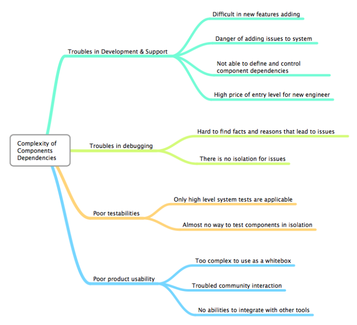

..
 This work is licensed under a Creative Commons Attribution 3.0 Unported
 License.

 http://creativecommons.org/licenses/by/3.0/legalcode

===========================
Fuel Pluggable Architecture
===========================

https://blueprints.launchpad.net/fuel/+spec/fuel-library-modularization

Problem description
===================

Our deployment process is very complicated. There are a lot of Puppet
modules used together by our manifests and dependencies between these
modules are also very complex and abundant.

This leads to the following consequences:

* It becomes very difficult to add new features. Even changes that
  could look minor from the first glance can easily break any other
  functionality. Trying to guess how any given change could affect
  dependencies and ordering of deployment process is very hard
  and error-prone.
* Debugging is also affected. Localizing bugs could be very troublesome
  due to manifests being complex and hard to understand. Debugging tools
  are also almost non-existent.
* Reproducing bugs and testing takes lots of time because we have no
  easy and reliable way to repeat only some part of the deployment.
  The only thing we can do is to start the process again and wait for
  several hours to get results.
* Snapshots are also not very helpful because deployment cannot be
  reliably stopped and the state saved. These actions most likely break
  deployment or at least change the ordering.
* New members of our team or outside developers who want to add some
  new functionality to our project are completely out of luck.
  They will have to spend many days just to understand how deployment
  works. And most likely will make a lot of hard to debug mistakes.
* Using our product is also not as easy as we would like it to be for customers
  and other people in the community. People usually cannot easily understand
  how the deployment works and have to just follow every step in documentation.
  It makes them unable to act if something is goes wrong. Integrating our
  Puppet library with any existing Puppet environments or any other deployment
  system out of question in most cases leaving us outside of community.

Proposed change
===============

If we want to address any of these issues we should find a way to make our
architecture less complex and more manageable. The best way to understand any
large monolithic structure is to try to take it apart, then learn how does
each piece work and then how do they connect with each other.

So we should try to separate the whole deployment process to many small parts
that could do only one or several closely related tasks. Each of these parts
would be easy to understand for a single developer. Testing and debugging could
also be done separately so localizing and fixing bugs would be much easier than
it is now.

Thinking about deployment process as a list of atomic tasks will make our
reference architectures and server roles much more dynamic. If you change what
tasks you are going to perform and their order you can create as many custom
sets of roles as you need without any modification of the tasks themselves.

Another good feature of separated deployment would be the ability to run
pre-deployment and post-deployment tests before and after these tasks.
They could be just sanity checks to determine if the task can be performed
before it is started. Or there could be some smoke tests that will check the
results of the previously performed tasks. Failed and passed tests will greatly
increase the feedback a user or developer is getting from the deployment
process making it possible to determine what have failed by just a single
glance at the deployment UI.

Each task can have some internal dependencies but most likely there would not
be too much of them. It will make manual analyzing of dependency graph possible
within a single task. Each task could also have their requirements. System
should be in the specific state before the task can be started and this can be
ensured by the pre-deployment tests.

Alternatives
------------

What other ways could we do this thing? Why aren't we using those? This doesn't
have to be a full literature review, but it should demonstrate that thought has
been put into why the proposed solution is an appropriate one.

Data model impact
-----------------

Changes which require modifications to the data model often have a wider impact
on the system.  The community often has strong opinions on how the data model
should be evolved, from both a functional and performance perspective. It is
therefore important to capture and gain agreement as early as possible on any
proposed changes to the data model.

Questions which need to be addressed by this section include:

* What new data objects and/or database schema changes is this going to
  require?

* What database migrations will accompany this change.

* How will the initial set of new data objects be generated, for example if you
  need to take into account existing instances, or modify other existing data
  describe how that will work.

REST API impact
---------------

Each API method which is either added or changed should have the following

* Specification for the method

  * A description of what the method does suitable for use in
    user documentation

  * Method type (POST/PUT/GET/DELETE)

  * Normal http response code(s)

  * Expected error http response code(s)

    * A description for each possible error code should be included
      describing semantic errors which can cause it such as
      inconsistent parameters supplied to the method, or when an
      instance is not in an appropriate state for the request to
      succeed. Errors caused by syntactic problems covered by the JSON
      schema defintion do not need to be included.

  * URL for the resource

  * Parameters which can be passed via the url

  * JSON schema definition for the body data if allowed

  * JSON schema definition for the response data if any

* Example use case including typical API samples for both data supplied
  by the caller and the response

* Discuss any policy changes, and discuss what things a deployer needs to
  think about when defining their policy.

Upgrade impact
--------------

If this change set concerns any kind of upgrade process, describe how it is
supposed to deal with that stuff. For example, Fuel currently supports
upgrading of master node, so it is necessary to describe whether this patch
set contradicts upgrade process itself or any working feature that we need
to support.

Security impact
---------------

Describe any potential security impact on the system.  Some of the items to
consider include:

* Does this change touch sensitive data such as tokens, keys, or user data?

* Does this change alter the API in a way that may impact security, such as
  a new way to access sensitive information or a new way to login?

* Does this change involve cryptography or hashing?

* Does this change require the use of sudo or any elevated privileges?

* Does this change involve using or parsing user-provided data? This could
  be directly at the API level or indirectly such as changes to a cache layer.

* Can this change enable a resource exhaustion attack, such as allowing a
  single API interaction to consume significant server resources? Some examples
  of this include launching subprocesses for each connection, or entity
  expansion attacks in XML.

For more detailed guidance, please see the OpenStack Security Guidelines as
a reference (https://wiki.openstack.org/wiki/Security/Guidelines).  These
guidelines are a work in progress and are designed to help you identify
security best practices.  For further information, feel free to reach out
to the OpenStack Security Group at openstack-security@lists.openstack.org.

Notifications impact
--------------------

Please specify any changes to notifications. Be that an extra notification,
changes to an existing notification, or removing a notification.

Other end user impact
---------------------

Aside from the API, are there other ways a user will interact with this
feature?

* Does this change have an impact on python-fuelclient? What does the user
  interface there look like?

Performance Impact
------------------

Describe any potential performance impact on the system, for example
how often will new code be called, and is there a major change to the calling
pattern of existing code.

Examples of things to consider here include:

* A periodic task might look like a small addition but if it calls conductor or
  another service the load is multiplied by the number of nodes in the system.

* Scheduler filters get called once per host for every instance being created,
  so any latency they introduce is linear with the size of the system.

* A small change in a utility function or a commonly used decorator can have a
  large impacts on performance.

* Calls which result in a database queries (whether direct or via conductor)
  can have a profound impact on performance when called in critical sections of
  the code.

* Will the change include any locking, and if so what considerations are there
  on holding the lock?

Other deployer impact
---------------------

Discuss things that will affect how you deploy and configure Fuel
that have not already been mentioned, such as:

* What config options are being added? Should they be more generic than
  proposed? Are the default values ones which will work well in
  real deployments?

* Is this a change that takes immediate effect after its merged, or is it
  something that has to be explicitly enabled?

* If this change is a new binary, how would it be deployed?

* Please state anything that those doing continuous deployment, or those
  upgrading from the previous release, need to be aware of. Also describe
  any plans to deprecate configuration values or features.  For example, if we
  change the directory name that instances are stored in, how do we handle
  instance directories created before the change landed?  Do we move them?  Do
  we have a special case in the code? Do we assume that the operator will
  recreate all the instances in their cloud?

Developer impact
----------------

Discuss things that will affect other developers working on Fuel,
such as:

* If the blueprint proposes a change to the driver API, discussion of how
  drivers would implement the feature is required.

Implementation
==============

Assignee(s)
-----------

Who is leading the writing of the code? Or is this a blueprint where you're
throwing it out there to see who picks it up?

If more than one person is working on the implementation, please designate the
primary author and contact.

Primary assignee:
  <launchpad-id or None>

Other contributors:
  <launchpad-id or None>

Work Items
----------

Work items or tasks -- break the feature up into the things that need to be
done to implement it. Those parts might end up being done by different people,
but we're mostly trying to understand the timeline for implementation.

Dependencies
============

* Include specific references to specs and/or blueprints in fuel, or in other
  projects, that this one either depends on or is related to.

* If this requires functionality of another project that is not currently used
  by Fuel, document that fact.

* Does this feature require any new library dependencies or code otherwise not
  included in Fuel? Or does it depend on a specific version of library?

Testing
=======

Please discuss how the change will be tested. It is assumed that unit test
coverage will be added so that doesn't need to be mentioned explicitly,
but discussion of why you think unit tests are sufficient and we don't need
to add more functional tests would need to be included.

Is this untestable in gate given current limitations (specific hardware /
software configurations available)? If so, are there mitigation plans (3rd
party testing, gate enhancements, etc).

Documentation Impact
====================

What is the impact on the docs team of this change? Some changes might require
donating resources to the docs team to have the documentation updated. Don't
repeat details discussed above, but please reference them here.

References
==========

Please add any useful references here. You are not required to have any
reference. Moreover, this specification should still make sense when your
references are unavailable. Examples of what you could include are:

* Links to mailing list or IRC discussions

* Links to relevant research, if appropriate

* Related specifications as appropriate

* Anything else you feel it is worthwhile to refer to
